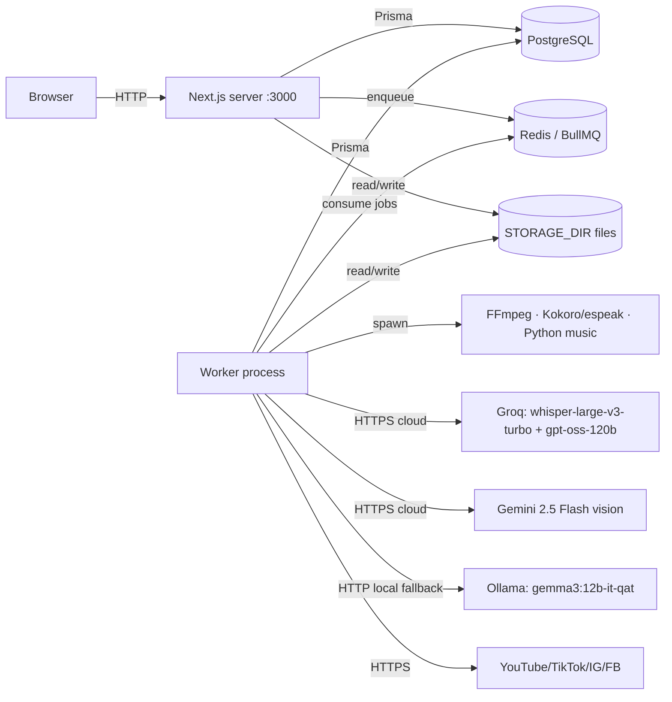
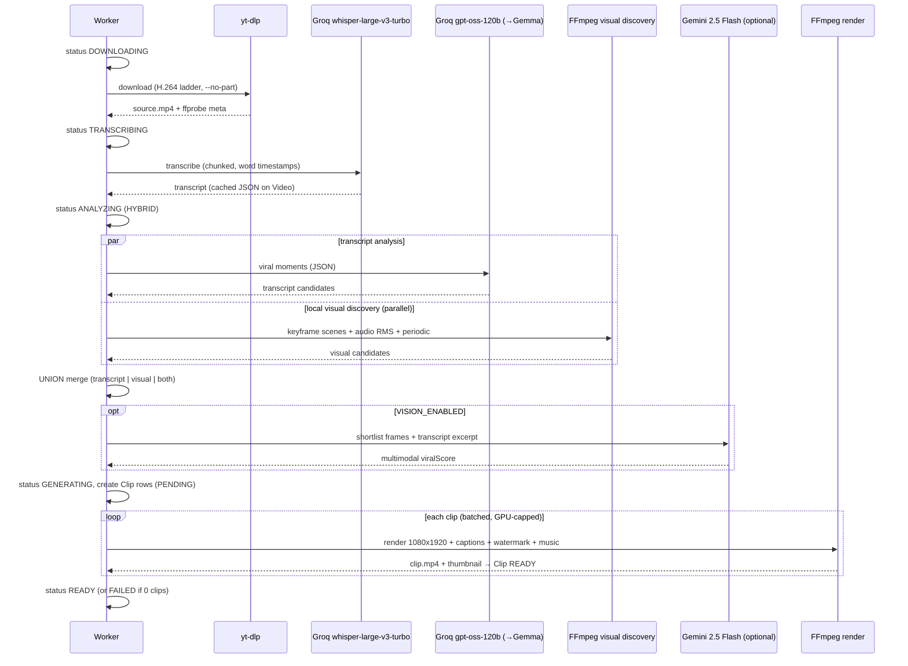
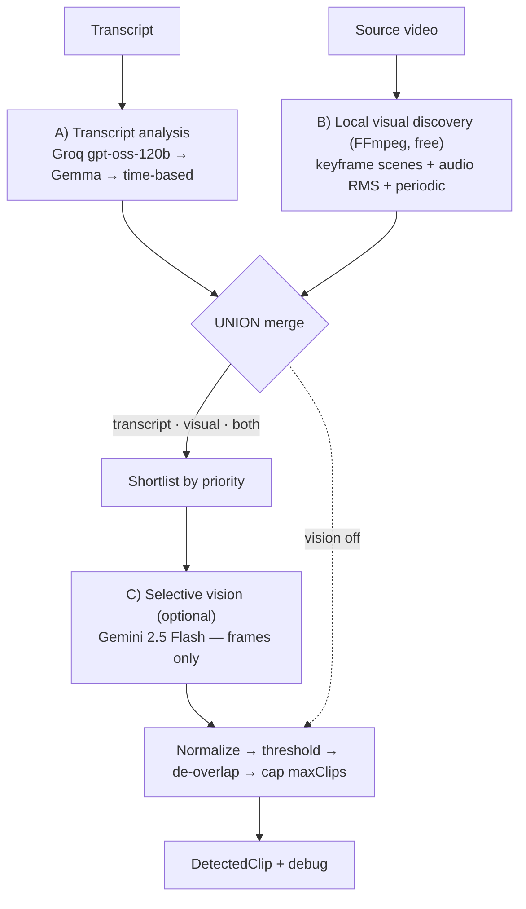
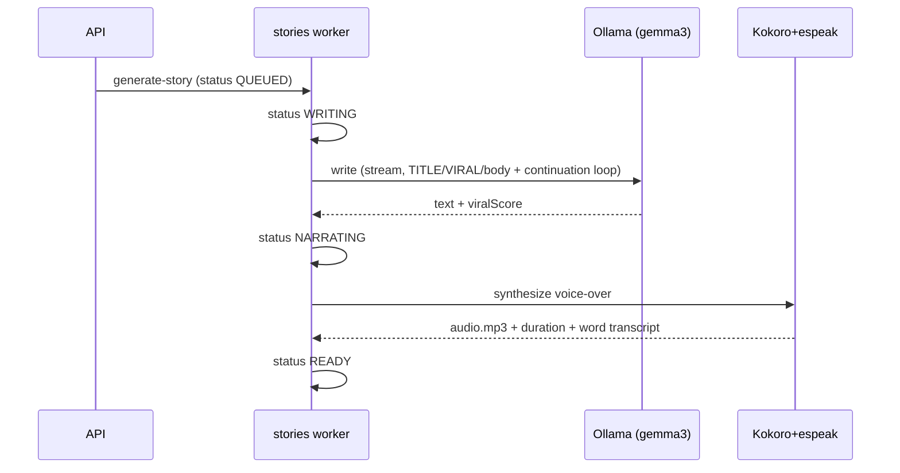
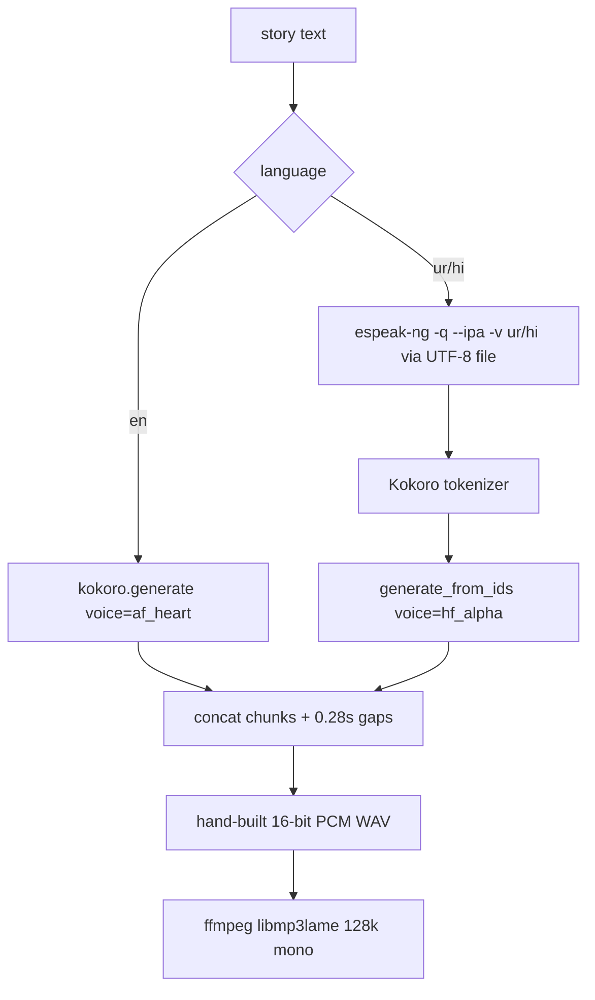
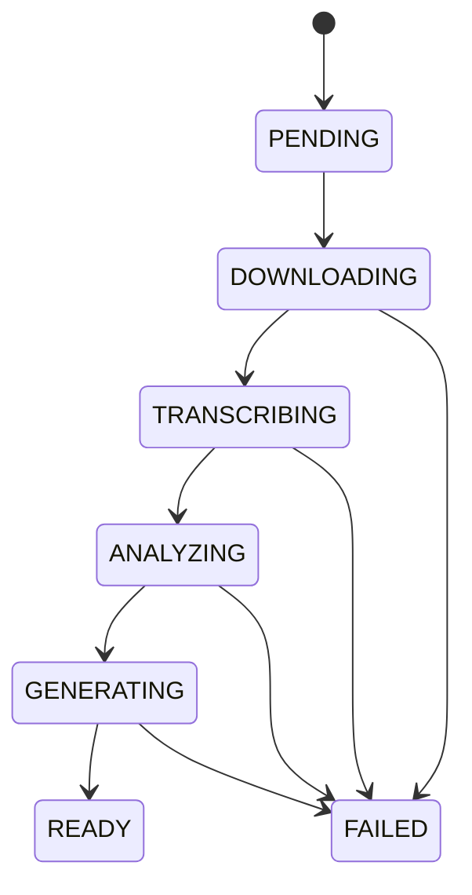

# ViralCut — Internal Workflows (End-to-End)

_How everything actually works under the hood — the pipelines, jobs, and data flows. No UI._

This is the engineering companion to `PROJECT-BRIEF.md` (overview) and `BUILD-PROMPT.md`
(rebuild spec). It documents every workflow the system runs: the exact sequence of steps,
what talks to what, where state lives, and how failures are handled.

---

## Models at a glance (exact names)

| Stage | Model / engine (exact id) | Provider | Role |
|---|---|---|---|
| **Transcription (STT)** | **`whisper-large-v3-turbo`** | **Groq** (cloud) | Primary — word-level timestamps, ~228× realtime |
| ↳ fallback STT | `ggml-large-v3` (whisper.cpp CUDA) · `Xenova/whisper-base.en` (transformers.js) | local | Only if Groq unset/fails |
| **Transcript viral analysis (LLM)** | **`openai/gpt-oss-120b`** | **Groq** (cloud) | Primary — picks viral moments from transcript |
| ↳ fallback analysis | **`gemma3:12b-it-qat`** (Ollama) → then time-based segmentation | local | On Groq failure/TPM limit |
| ↳ optional analysis | `claude-opus-4-8` | Anthropic | Only if `AI_PROVIDER=anthropic` |
| **Local visual discovery** | FFmpeg (keyframe scene detect + audio RMS) | local | Free — finds where visual change happens |
| **Selective vision (multimodal)** | **`gemini-2.5-flash`** | Google Gemini | Judges shortlisted candidates from frames; **off by default** |
| **Voice-over (TTS)** | **`onnx-community/Kokoro-82M-v1.0-ONNX`** + `espeak-ng` | local | English `af_heart`, Urdu `hf_alpha` |
| **Background music** | **`stabilityai/stable-audio-open-1.0`** (default) · `facebook/musicgen-small` | local (Python) | Stable Audio Open = commercial-safe |
| **Clip render/encode** | `h264_nvenc` → `libx264` fallback | FFmpeg | GPU encode, CPU fallback |

---

## 0. Runtime topology (process model)

Three long-lived processes + local services. The **web server only enqueues**; the **worker
does all heavy lifting**.

- **Next.js server** (`npm run dev` / `next start`): API routes, auth, serving media, enqueuing jobs.
- **Worker** (`tsx src/workers/index.ts`): 3 BullMQ workers + a 60s scheduler tick (scheduler +
  stale-job reaper + publish auto-retry). Boots via `src/workers/loadEnv.ts` first
  (`process.loadEnvFile('.env')`, no dotenv dep).
- **PostgreSQL + Redis** (Docker `viralcut-postgres` / `viralcut-redis`).
- **Cloud AI (primary)**: **Groq** (`whisper-large-v3-turbo` STT + `openai/gpt-oss-120b` analysis),
  **Gemini** (`gemini-2.5-flash`, selective vision, off by default).
- **Local AI (fallback + always-local stages)**: **Ollama** (`gemma3:12b-it-qat`, analysis fallback;
  `:11434`), whisper.cpp CUDA / transformers.js (STT fallback), **FFmpeg** (visual discovery + render),
  **Kokoro-82M**/espeak (TTS), Python music venv (Stable Audio Open).
- **Storage**: local filesystem under `STORAGE_DIR` (keys like `videos/<id>/…`, `clips/<id>/clip.mp4`,
  `stories/<id>/audio.mp3`, `music/<id>.mp3`, `cache/<id>/…`, `generic/…`). Served via `/api/media/[...path]`.

**Golden rule:** anything slow (download, transcribe, LLM, render, TTS, music, publish) runs in the
**worker**, never in a request handler. Requests create a DB row + enqueue a job and return.

---

## 1. Job queue engine

Three Redis-backed BullMQ queues, created lazily on `globalThis` (survive Next HMR):

| Queue | Job kinds | Worker concurrency | lockDuration |
|---|---|---|---|
| `video-processing` | `process-video`, `regenerate-clip` | `VIDEO_WORKER_CONCURRENCY` (1) | 10 min |
| `publishing` | `publish` | `PUBLISH_WORKER_CONCURRENCY` (2) | 5 min |
| `stories` | `generate-story`, `story-audio`, `generate-music` | `STORY_WORKER_CONCURRENCY` (1) | 20 min |

- **Job options (all queues):** `attempts: 3`, exponential backoff 10 s, `removeOnComplete`
  {age 24 h, count 500}, `removeOnFail` {age 7 d}.
- **Payloads are discriminated unions** in `job.data` (`{kind, data}`); workers `switch` on `kind`.
- **Dedup rules (deliberate):**
  - `enqueueProcessVideo` uses **no fixed jobId** — a deterministic id would let a lingering
    completed job in Redis silently suppress a reprocess/retry.
  - `enqueuePublish` uses jobId `publish-<publicationId>` and **removes it first**, so re-enqueuing
    the same publication on retry actually runs again instead of being deduped.
- **Redis connection** (`lib/redis.ts`): `maxRetriesPerRequest: null` (BullMQ requirement),
  `enableReadyCheck: false`, an `error` listener so a disconnect reconnects instead of crashing.
- **Worker keep-alive:** `unhandledRejection` / `uncaughtException` handlers log and keep the
  process alive (Node ≥15 would otherwise exit and kill every in-flight job).

---

## 2. Video → vertical clips workflow

Entry: `POST /api/videos` (YouTube) or `/api/videos/upload` (file) creates a `Video` (status
`PENDING`) → `enqueueProcessVideo`. The worker runs `processVideo`:

### 2.1 Ingest
- **YouTube** (`download.ts`): `execFile` yt-dlp directly (not the shell wrapper — cmd.exe mangles
  `<` in `[height<=1080]`). Format ladder prefers **avc1/H.264** → merges to mp4. `--no-part`
  (avoid AV-blocked `.part` rename → WinError 32), `--no-mtime`, retries 10, socket-timeout 30;
  stale `source.*` partials cleared first. Hard `DOWNLOAD_TIMEOUT_MS` (30 min) + SIGKILL.
- **Upload**: streamed to disk (middleware excludes the route so the 2 GB body limit applies;
  `MAX_UPLOAD_BYTES` 3 GB), then `ffprobe` for metadata.
- **AI Story source**: audio-only; footageMode forced `GENERIC` (see §4/§2.4).

### 2.2 Transcription (`transcription.ts`) — `TRANSCRIPTION_PROVIDER`, default **`groq`**
- **groq** (primary) — Groq **`whisper-large-v3-turbo`** (`/openai/v1/audio/transcriptions`,
  `response_format=verbose_json`, `timestamp_granularities=[word,segment]`). ~228× realtime; a 14-min
  video ≈ 12 s. Long audio is **auto-chunked** (~25-min mono-mp3 chunks) under Groq's file limit,
  transcribed concurrently, then offset + de-duped by word start. Auto language detect (omit
  `language`). `GROQ_API_KEY` from env only; **key never logged**.
- **local** (fallback) — whisper.cpp CUDA CLI, **`ggml-large-v3`**: `-oj --max-len 1
  --split-on-word` — one **whole word** per segment (`-sow` essential; without it Urdu/Arabic split
  into sub-word tokens that break letter-joining).
- **transformers** (fallback) — in-process ONNX Whisper (**`Xenova/whisper-base.en`**) in an
  **isolated child** (`transcribe-runner.ts`) because a native onnxruntime GPU segfault is
  uncatchable; parent falls back **GPU→CPU→none**. `return_timestamps:'word'`, chunk 30 s / stride 5 s.
- **openai** (fallback) — Whisper API, chunked ~20 min under 25 MB.
- Result `TranscriptWord[]` (word start/end) → **cached as JSON on the Video**, reused on reprocess.
- **Hinglish** (`hi-Latn`): transcribe as Hindi (Devanagari) → `romanizeDevanagari()` → loose Latin.

### 2.3 Clip detection — HYBRID (`ai/hybridDetect.ts`)

VIRAL mode runs a **hybrid** detector; FULL mode still uses plain segmentation. Two independent
discovery paths run **in parallel**, are **union-merged**, then optionally judged by a vision model:

**A) Transcript analysis** (`clipDetection.ts` → `detectViralClipsFallback`) — provider chain
`ANALYSIS_PROVIDER` (default **groq / `openai/gpt-oss-120b`**) → **`gemma3:12b-it-qat`** (Ollama) →
(caller) time-based segmentation. Groq uses `json_object` (gpt-oss ignores `json_schema`) + an explicit
shape instruction; Ollama uses `format` JSON schema; optional `claude-opus-4-8`. Same prompt/criteria
across providers; clips clamped 15–60 s, 0–100 score, threshold-filtered. **maxClips is a MAX, not a
target** — searches the whole transcript, no padding of weak clips.

**B) Local visual discovery** (`visualDiscovery.ts`) — FREE, FFmpeg-only, **transcript-independent**
so a visually strong *silent* moment still becomes a candidate:
- **Scene cuts** — `detectScenes` decodes **keyframes only** (`-skip_frame nokey`, `scale=320`,
  `select='gt(scene,SCENE_THRESHOLD)'`, parse `lavfi.scene_score` from stderr): ~7× faster than full
  decode (~10 s for 35 min). Keyframes are seconds apart → scores meaningful on low-motion content.
- **Audio energy** — windowed RMS from `extractPcmF32` (16 kHz mono): reactions/impacts/peaks (NOT speech).
- **Periodic coverage** — an anchor every `VISUAL_SAMPLE_INTERVAL_SEC` (45 s) so long continuous shots
  aren't ignored.
- Interest points → clustered → padded to 15–60 s → overlaps merged → **capped `MAX_VISUAL_CANDIDATES`
  (30)**. Each carries `heuristicScore` (discovery ranking, **NOT** virality) + `signals`
  {sceneChange, sceneDensity, motionActivity, audioEnergy}. Cached to `cache/<id>/visual.json`.

**Merge** (`candidateMerge.ts`) — **UNION**, not intersection. Overlapping/near transcript+visual
candidates combine into one `source:"both"` keeping **both** evidences; scores are **never averaged**.
Sources: `transcript` | `visual` | `both`.

**C) Selective vision** (`vision/`, gated by `VISION_ENABLED`, default off) — the top
`VISION_MAX_CANDIDATES` (20) by priority go to the `VisionProvider` (**`gemini-2.5-flash`**) as **3
representative frames** (`captureThumbnail`, `VISION_FRAME_WIDTH` 640 — start/mid/end) + transcript
excerpt + signals. **Never the whole video** (~$0.003 for 6 candidates vs ~$0.19 full-video). The
vision score is final and can rate a **silent-but-visual** clip very high. Cached to
`cache/<id>/vision.json`.

**Final scoring** — vision score if judged, else evidence score (transcript `viralScore`; a
visual-only candidate without vision is capped so a raw heuristic can't outrank a judged clip) →
threshold → de-overlap (>0.5) → sort → cap `maxClips`. Output =
`DetectedClip{start,end,title,viralScore,reason}` + debug `{source, transcriptScore,
visualHeuristicScore, multimodalScore, visualSignals}` (debug not persisted to the Clip row).

**Fallbacks (a stage failure never fails the job):** analysis groq→Gemma→time; visual failure →
transcript-only; per-candidate vision failure → evidence score; hybrid yields nothing → caller segments.

**FULL mode** (`ai/segmentation.ts`): sequential `segmentSeconds` cuts snapped to sentence boundaries;
short tail merged; guarded by `FULL_MODE_MAX_PARTS=500`; "Part N". Untouched by the hybrid.

### 2.4 Clip rendering (`ffmpeg.ts` → `renderClip`)
Per clip, batched `CLIP_RENDER_CONCURRENCY` (live 6) but capped to `GPU_RENDER_CONCURRENCY_CAP`
(2) when encoder is `h264_nvenc`. Filtergraph builds the **1080×1920** frame:
1. **Blurred fill**: cover-scale bg to a tiny 360×640, `boxblur=14:1`, upscale to 1080×1920
   (≈9× less blur work/frame). Original contain-scaled + centered on top.
2. **GENERIC footage**: concat random stock clips as the visual layer (audio still from source);
   if no stock + no source video, synthesize a solid `0x0b0b12` background.
3. **Captions**: burn the `.ass` via libass `subtitles` filter + `fontsdir` (§3).
4. **Overlays**: `@handle` watermark bottom-center (h·0.90), "Part N" (h·0.135), optional short
   title (h·0.05).
5. **Audio**: `[0:a]loudnorm(I=-16:TP=-1.5)[voice]`; if a music bed → loop it (`-stream_loop -1`),
   `volume=MUSIC_MIX_VOLUME (0.08)`, `afade in 1.2s`, `amix=…:duration=first:normalize=0`
   (see §6). Output AAC 128 k, 30 fps, `yuv420p`, `+faststart`.
6. **Encoder fallback**: try `env.ffmpegVideoEncoder` (NVENC p5/cq23); on failure retry `libx264`
   (veryfast/crf23). Hard `RENDER_TIMEOUT_MS` (15 min) + SIGKILL.
7. Thumbnail captured → `Clip` set `READY`.

### 2.5 Completion
- All clips rendered → `Video` `READY`. If **every** clip failed → `Video` `FAILED` (never an empty
  READY).
- **Reprocess** (`POST /api/videos/[id]/process`): deletes existing clips + media, sets
  `transcript = DbNull` (forces re-transcribe on language change), re-enqueues → full re-detect.
- **Regenerate one clip** (`POST /api/clips/[id]/regenerate`): re-render in place (`variation:false`)
  or a time-shifted alt take (`variation:true`) — keeps the same clip row.

---

## 3. Captions workflow (`captions/subtitles.ts`)

`TranscriptWord[]` → cues → `.ass` (burned) + `.srt` (sidecar), written under
`STORAGE_DIR/.captions/<clipId>.ass`, deleted after the render (SRT kept as `Clip.captionsKey`).

1. **Cue grouping**: ≤`MAX_WORDS_PER_CUE` (4), ≤`MAX_CHARS_PER_CUE` (26), ≤`MAX_CUE_DURATION`
   (2.6 s); forced break after a word ending `.!?`; cue end floored to start+0.4 s.
2. **Style** (`captionStyle`): one of 7 `CAPTION_STYLES` (default/bold(Impact)/yellow/green/boxed/
   karaoke/pop). ASS colors `&HAABBGGRR`.
3. **Font** (`captionFont(language)`): Arabic-script {ur,ar,fa,ps} → **Noto Naskh Arabic** (rtl,
   no-uppercase); Devanagari {hi,mr,ne} → **Noto Sans Devanagari**; else Arial (uppercased). Impact
   only swaps in for `bold` when base is Arial. Fonts loaded from `tools/fonts` via libass `fontsdir`.
4. **Karaoke** (the subtle part):
   - **Auto-wrap fix**: libass silently **drops** karaoke timing on an auto-wrapped line →
     `packKaraokeLines()` packs words into explicit ≤`KARAOKE_CHARS_PER_LINE` (13) lines joined
     with manual `\N`, `WrapStyle: 0`.
   - **RTL fix**: LTR uses `\kf` (smooth L→R sweep); RTL uses `\k` (instant) — `\kf` always sweeps
     L→R and would run backwards through Urdu/Arabic.
   - Timing: gaps `{\k<centiseconds>}`, word highlight `{\kf|k<dur>}`, `dur` floored to 6 cs.
5. **Windows path fix**: subtitle/font paths passed **relative to cwd** (the drive-letter colon is a
   filter option separator even inside quotes); `.ass` written on the same drive so a clean relative
   path exists.

---

## 4. AI Stories workflow

### 4.1 Writing (`ai/storyGeneration.ts`)
- **Provider switch** `useCloud()` = `AI_PROVIDER==='anthropic' && anthropicApiKey`. Otherwise
  **local Ollama** — so generation works offline / when the cloud is unreachable.
- **Ollama must stream** (`stream: true`): with `stream:false` it sends headers only after the whole
  minutes-long answer, blowing undici's header timeout. NDJSON deltas accumulated; only the app's
  `AbortController` (`STORY_GEN_TIMEOUT_MS` 15 min) applies.
- **Continuation loop**: local models truncate long structured output, so it uses plain-text
  `TITLE:/VIRAL:/body` + re-prompts "continue seamlessly" (feeding the last ~4000 chars) until words
  ≥ target·0.75 (≤5 rounds). `num_predict` 3500/call, `num_ctx = max(env, 16384)`, target =
  `durationMin · 145` words.
- **Anthropic path**: one-shot `output_config.json_schema`, `thinking: adaptive`, `max_tokens 24000`,
  streamed, `stop_reason==='refusal'` handled, zod-validated.
- **Viral score**: AI self-rates 0–100 (schema field / `VIRAL: n` line), clamped, default 75.
- **ttsText is always `null`** now — Urdu is narrated from its Arabic-script `text` directly (the old
  Urdu→Devanagari path was removed).

### 4.2 Orchestration (`story/pipeline.ts`)
`processStoryGeneration`: clampDuration 3–15 min → `WRITING` → write (if text empty) → `NARRATING`
→ synthesize → `READY` (or `FAILED` capturing `errorMessage`). Admin paste = `MANUAL` source,
skips writing → straight to narration.

### 4.3 Claim → video (`POST /api/stories/[id]/generate-video`)
Race-safe: `prisma.story.updateMany({where:{status:READY, claimedById:null}})` atomically flips to
`CLAIMED` (count 0 ⇒ 409 "just claimed"). Creates an audio-only `Video` (`footageMode=GENERIC`),
**copies the voice-over mp3 into the video's own storage** (survives later story deletion), reuses
the cached word transcript (skips re-transcription), enqueues `processVideo`. Rolls the claim back
to `READY` on any failure.

---

## 5. TTS workflow (`tts/index.ts`)

One Kokoro-82M model (`onnx-community/Kokoro-82M-v1.0-ONNX`, q8/cpu, lazy singleton) serves both
languages:

- **Chunking** (`chunkForTts`): `MAX_CHARS_PER_CHUNK=240`, split on sentence enders (incl. `।؟`)
  then clause punctuation (incl. Arabic `،`), then hard-slice.
- **Urdu/Hindi bypass**: kokoro-js's phonemizer is English-only + validates the voice list, so Indic
  text goes espeak IPA → `tts.tokenizer` → `tts.generate_from_ids({voice})`, sidestepping both.
  espeak text passed via a **UTF-8 temp file** (Windows mangles non-Latin native-exe args).
- **espeak voice** independent of Kokoro voice: `hi`/`hi-*` → `-v hi`, else `-v ur`; Kokoro voice for
  any Indic = `hf_alpha`. English = `af_heart`.
- Output: `stories/<id>/audio.mp3`; `Story.voice='kokoro:<voice>'`, `durationSec` from sample count,
  word transcript cached. `GAP_SECONDS=0.28` between chunks.

---

## 6. Background music workflow

### 6.1 Generation (`services/music/generate.ts`, `stories` queue)
`POST /api/admin/music` (JSON) creates a pending `BackgroundMusic` row (`storageKey=""`, source
`GENERATED`) → `enqueueGenerateMusic`. Worker `generateMusicTrack`:
1. `execFile` the Python venv (`tools/musicgen/venv`) running the backend script, `HF_TOKEN` passed
   in the subprocess env, `SIGKILL` after `MUSICGEN_TIMEOUT_MS` (30 min).
   - **stable-audio** (default, commercial-safe): `stable_audio_generate.py` (diffusers
     `StableAudioPipeline`, cuda fp16 / cpu fp32, `STABLE_AUDIO_STEPS` 100, negative prompt strips
     vocals, duration 5–45 s, 44.1 kHz wav). Gated model → needs `HF_TOKEN`.
   - **musicgen** (non-commercial): `musicgen_generate.py` (transformers, 5–30 s).
2. `wavToMp3`: ffmpeg `loudnorm=I=-16:TP=-1.5` → 160 k stereo mp3 at `music/<id>.mp3`.
3. `probe` backfills `durationSec` → update the row's `storageKey`.
- **Generating state** = empty `storageKey` (no status column); API GET maps `generating = !storageKey`.
- **Retry/orphan fix**: a failed attempt must **not** delete the row (BullMQ retries → "record not
  found"). `cleanupFailedMusicRow` runs only in the worker's `failed` handler once
  `attemptsMade >= attempts`, idempotently (`deleteMany where storageKey=""`) + removes any orphan mp3.

### 6.2 Claim + mix
- **Claim** (`PATCH /api/music`): a `$transaction` frees the user's prior claim then claims the new
  track (exclusive — a claimed track vanishes from others' lists; 409 if already claimed). Toggle
  `backgroundMusicEnabled`.
- **Mix** (`pipeline.ts` → `renderClip`): if the clip's owner has an enabled claimed track, its path
  is passed as `backgroundMusicPath`. Static duck (not sidechain): looped, `volume=MUSIC_MIX_VOLUME`
  (0.08 ≈ 25 dB under the loudnorm'd voice; `MUSIC_MIX_VOLUME_SOLO` 0.45 when a clip has no speech),
  `amix normalize=0 duration=first`. `fs.existsSync` guard silently disables music if the file is missing.

---

## 7. Publishing workflow

### 7.1 Connect (OAuth)
`GET /api/social/connect/[platform]` → generate CSRF `state`, set httpOnly `vc_oauth_<slug>` cookie
(10 min), redirect to consent. `GET /api/social/callback/[platform]` (public, middleware-exempt) →
validate state vs cookie → `handleCallback` → upsert `SocialAccount` with **AES-256-GCM encrypted**
tokens (`accessTokenEnc`/`refreshTokenEnc`; format `base64(iv|tag|ct)`), platform meta JSON. Graph
API pinned v21.0; TikTok uses PKCE (verifier derived from state).

### 7.2 Publish
`executePublication` (`services/publishing/publisher.ts`): refresh token if expiring (60 s skew,
persist rotation) → compose title/description (`composeTitle` adds "| Part N"; `composeDescription`
merges + dedups `DEFAULT_HASHTAGS`) → `provider.publish(...)`:
- **YouTube**: resumable upload (init session → PUT bytes), `#Shorts`, categoryId 22, public.
- **TikTok**: Content Posting API, creator_info, single-chunk `FILE_UPLOAD`, poll status
  (unaudited-app → `SELF_ONLY`).
- **Instagram**: pull-based REELS container from a **signed public media URL** → poll → publish.
- **Facebook**: video_reels 3-phase, uploads bytes to `rupload.facebook.com` (avoids robots pull block).
- Result → `PUBLISHED` (+ `externalPostId`/`externalUrl`) or `FAILED`; each step logged to
  `PublicationLog`. `PublishError.retryable` → leave `QUEUED` and rethrow for BullMQ backoff; else
  terminal `FAILED`.

### 7.3 Publish All (sequential drip)
`POST /api/videos/[id]/publish-all` creates one **batch per platform** (`batchId`/`batchSeq`/
`batchIntervalMin`); only the **first** clip is `QUEUED`+enqueued, the rest `SCHEDULED`. On success
the publisher **chains the next** (`enqueueNextInBatch`, delay = `batchIntervalMin·60000`); a failure
never chains → the batch pauses until that clip succeeds.

### 7.4 Signed media (`lib/media-url.ts` + `/api/media`)
IG/FB pull media **server-side without a cookie**, so media URLs are **HMAC-SHA256 signed** (6 h TTL,
`AUTH_SECRET`). `/api/media/[...path]` authorizes by valid signature **OR** session, does HTTP
range/206 for scrubbing, and returns **404 (not 401)** on unauth (no key-existence leak).

### 7.5 Scheduler + auto-retry (60 s tick, `workers/index.ts`)
- **Scheduler** (`scheduler.ts`): for each due `AutoPublishConfig` (interval + daily window, wraps
  midnight), pick the next `APPROVED` unpublished clip per platform → create `Publication` + enqueue.
- **Auto-retry** (`autoRetryStuckPublications`): a `FAILED` batch publication older than
  `PUBLISH_AUTO_RETRY_AFTER_MS` (5 min) with `attempts < PUBLISH_AUTO_RETRY_MAX` (5) is reset to
  `QUEUED` and re-enqueued (25/tick) — so one transient failure can't permanently stall a drip.

---

## 8. Auth / session workflow

- **Register** (`/api/auth/register`): zod (email, password ≥8, name 1–120) → unique email +
  unique name (case-insensitive, DB index + P2002 → 409) → create User + nested `AutoPublishConfig`
  → issue token + cookie.
- **Login** (`/api/auth/login`): identifier with `@` → email lookup (lowercased), else name lookup
  (case-insensitive). Uniform "Invalid credentials" 401. bcrypt cost 12.
- **Session**: jose **HS256** JWT (`sub`=user id, `email` claim), httpOnly cookie `vc_session`,
  `AUTH_SESSION_DAYS` (30). **Fails closed in production** if `AUTH_SECRET` missing/default.
- **Edge/Node split**: `lib/session.ts` (jose only, edge-safe) is what **middleware** imports;
  `lib/auth.ts` (bcrypt/Prisma/cookies) is Node-only. Middleware gates `/dashboard` + `/api/*`
  (public prefixes: `/api/auth/`, `/api/social/callback/`, `/api/media/`; excludes the upload routes
  so large bodies aren't capped).
- **Admin** = `ADMIN_EMAILS` allowlist vs the session email claim. Because admin rides on the claim,
  `PATCH /api/auth/me` **re-issues the token on email change**.

---

## 9. Reliability workflows

| Mechanism | What it does |
|---|---|
| **Stale-job reaper** (60 s) | Fails a Video past `STALE_JOB_MS` (30 min) **only if no clip advanced** in the window (no false-fail of long-but-active renders); also fails clips stuck `RENDERING`. |
| **Resume-aware processVideo** | On retry with existing clips, re-render only non-`READY` clips (reset to `PENDING`); if all `READY`, jump to `READY`. Transcript reused from cache. |
| **Isolated STT subprocess** | Native onnxruntime segfault kills only the child; parent falls back GPU→CPU→none. |
| **Hybrid graceful degradation** | Analysis groq→**gemma3:12b-it-qat**→time-based; visual-discovery failure → transcript-only; per-candidate vision failure → evidence score. A visual/vision failure **never** fails a job whose transcript path succeeded. |
| **Hard timeouts + SIGKILL** | render 15 m, transcribe 20 m, download 30 m, AI 5 m, story-gen 15 m, music 30 m. |
| **Queue dedup fixes** | No fixed jobId for reprocess; remove-then-add for publish retries. |
| **Music retry fix** | Never delete a pending row mid-retry; clean up only after attempts exhausted. |
| **Worker keep-alive** | `unhandledRejection`/`uncaughtException` handlers keep the worker up. |

> **Known gap:** processes are **session-bound** (started in-session, no supervisor). A machine
> reboot or session restart stops the dev server + worker (and Docker if Desktop closes). The durable
> fix is a supervised service / `start.ps1` detached windows.

---

## 10. State machines

- **Video**: `PENDING → DOWNLOADING → TRANSCRIBING → ANALYZING → GENERATING → READY` (any → `FAILED`).
- **Clip**: `PENDING → RENDERING → READY → APPROVED | REJECTED` (→ `FAILED`).
- **Story**: `DRAFT/QUEUED → WRITING → NARRATING → READY → CLAIMED` (→ `FAILED`; `GENERATING` = legacy).
- **Publication**: `SCHEDULED → QUEUED → PUBLISHING → PUBLISHED` (→ `FAILED`; `CANCELLED` defined).

---

## 11. Storage & media serving

- **Keys** under `STORAGE_DIR`: `videos/<id>/source.*`, `clips/<id>/clip.mp4` + `thumb.jpg`,
  `.captions/<clipId>.ass` (transient), `stories/<id>/audio.mp3`, `music/<id>.mp3`, `generic/<name>`,
  **`cache/<id>/visual.json`** + **`cache/<id>/vision.json`** (hybrid discovery/vision caches).
- `resolveKey` guards against path traversal. `publicUrl(key)` → `/api/media/<key>` (or
  `MEDIA_PUBLIC_BASE` if set).
- **Serving** (`/api/media/[...path]`): dual-auth (session OR HMAC signature), HTTP range/206,
  immutable cache for signed URLs, private for session, 404 on unauth.

---

## 12. Config knobs by workflow

| Workflow | Key env vars (model in **bold**) |
|---|---|
| STT | `TRANSCRIPTION_PROVIDER`=**groq**, `GROQ_API_KEY`, `GROQ_STT_MODEL`=**whisper-large-v3-turbo**; fallback `WHISPER_CLI`/`WHISPER_MODEL` (**ggml-large-v3**), `TRANSFORMERS_WHISPER_MODEL` |
| Transcript analysis | `ANALYSIS_PROVIDER`=**groq**, `GROQ_ANALYSIS_MODEL`=**openai/gpt-oss-120b**; fallback `OLLAMA_MODEL`=**gemma3:12b-it-qat**, `OLLAMA_NUM_CTX`; `ANTHROPIC_MODEL`=**claude-opus-4-8**; `AI_TIMEOUT_MS` |
| Local visual discovery | `VISUAL_DISCOVERY_ENABLED`, `SCENE_THRESHOLD` (0.1, keyframe-tuned), `MAX_VISUAL_CANDIDATES` (30), `VISUAL_SAMPLE_INTERVAL_SEC` (45) |
| Selective vision | `VISION_ENABLED` (false), `VISION_PROVIDER`=gemini, `GEMINI_API_KEY`, `GEMINI_VISION_MODEL`=**gemini-2.5-flash**, `VISION_FRAME_WIDTH` (640), `VISION_MAX_CANDIDATES` (20) |
| Render | `FFMPEG_VIDEO_ENCODER` (**h264_nvenc**→libx264), `CLIP_RENDER_CONCURRENCY`, `GPU_RENDER_CONCURRENCY_CAP`, `RENDER_TIMEOUT_MS` |
| TTS | **Kokoro-82M** (`onnx-community/Kokoro-82M-v1.0-ONNX`), `STORY_VOICE_EN`=af_heart/`_UR`=hf_alpha, `ESPEAK_PATH` |
| Music | `MUSIC_BACKEND`=stable-audio (**stabilityai/stable-audio-open-1.0**), `HF_TOKEN`, `STABLE_AUDIO_STEPS`, `MUSIC_MIX_VOLUME` (0.08), `MUSICGEN_TIMEOUT_MS` |
| Story writing | `AI_PROVIDER` (ollama, **gemma3:12b-it-qat**) or anthropic (**claude-opus-4-8**), `STORY_GEN_TIMEOUT_MS` |
| Queue/worker | `*_WORKER_CONCURRENCY`, `STALE_JOB_MS`, `PUBLISH_AUTO_RETRY_*` |
| Publish | `YOUTUBE_*`, `TIKTOK_*`, `INSTAGRAM_*`, `META_*`, `ENCRYPTION_KEY`, `APP_URL` |
